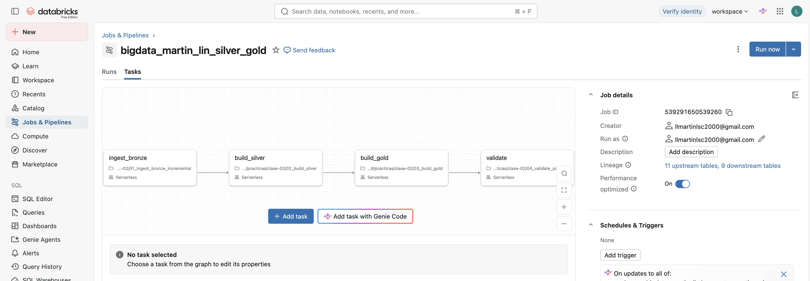
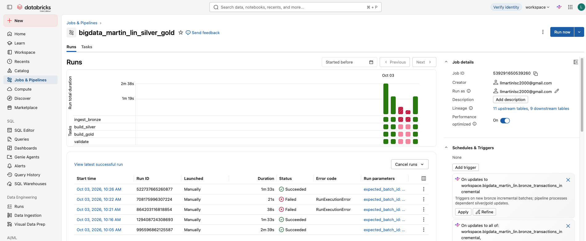
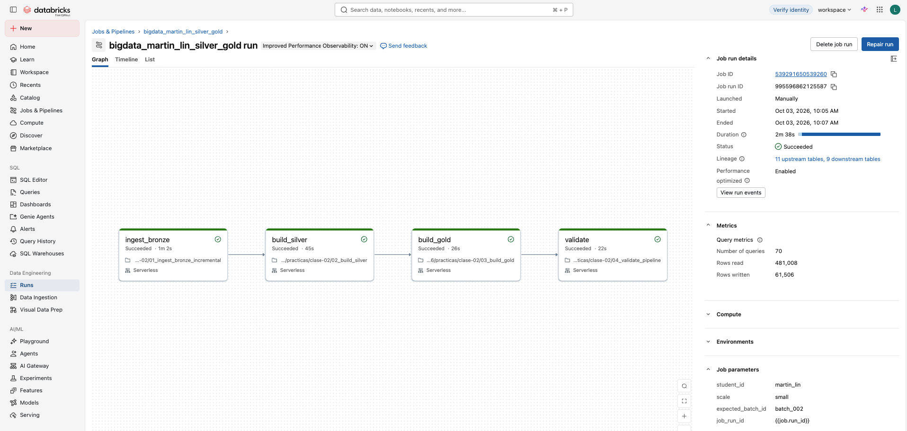
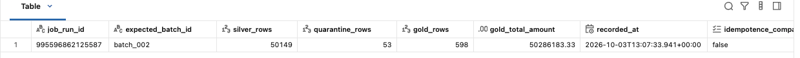
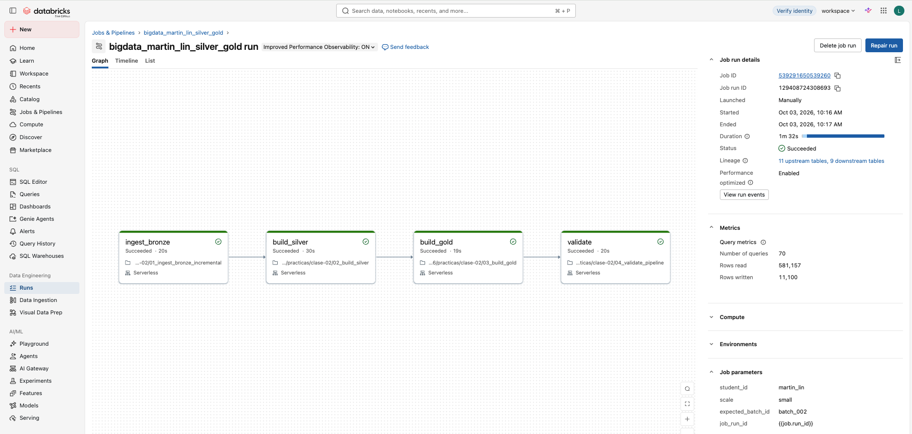
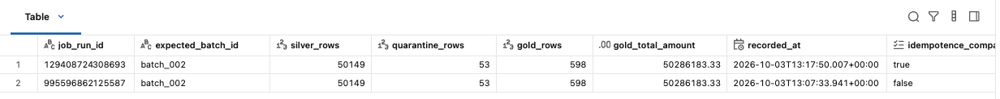

# **Nombre y student_id**

- Nombre: Lucas Martin Lin
- `student_id`: martin_lin

---

# **Captura del DAG del Job con las cuatro tareas**

---

# **URL del Job o su nombre exacto**

- URL del job: https://dbc-53280fb6-26f3.cloud.databricks.com/jobs/539291650539260?o=7474658404139451
- Nombre del job: bigdata_martin_lin_silver_gold

---

# **Resultados de la primera y segunda ejecución.**

## Resultados de la primera ejecución

De la tarea *validate run* se obtiene al final:

## Resultados de la segunda ejecución

De la tarea *validate run* se obtiene al final:

---

# **Cantidades aceptadas y rechazadas para batch_002**

De la tarea **validate run** del primer run con batch_002:
- Aceptados: 200
- Rechazados: 2

---

# **Explicación breve de por qué `COPY INTO` y `MERGE` resuelven problemas diferentes**

`COPY INTO` resuelve el problema de la **ingesta de archivos**: carga datos desde una ubicación de almacenamiento (CSV, JSON, Parquet, etc.) a una tabla Delta y es **idempotente a nivel de archivo**. Lleva registro de qué archivos ya cargó, por lo que si se reejecuta no vuelve a insertar los mismos archivos. Sin embargo, no analiza el contenido de las filas: solo agrega lo que proviene de archivos nuevos, sin actualizar ni borrar registros existentes.

`MERGE` resuelve el problema de la **reconciliación de registros**: compara una fuente con una tabla destino a nivel de fila, usando una condición de clave, y según el resultado ejecuta `INSERT` (si no existe), `UPDATE` (si cambió) o `DELETE`. Sirve para upserts, deduplicación y captura de cambios (CDC), y también hace idempotente la reejecución, pero a nivel de **clave de negocio**, no de archivo.

En resumen: `COPY INTO` responde "¿qué archivos nuevos faltan cargar?", y `MERGE` responde "¿cómo concilio estas filas con las que ya tengo?". Por eso suelen combinarse: `COPY INTO` para traer los datos crudos a bronze, y `MERGE` para consolidarlos en silver o gold sin duplicados.

---

# **Las cuatro visualizaciones y una respuesta explícita para cada pregunta**

Ver archivo "05_visualizacion.ipynb"

---

# **Respuestas a las 20 preguntas de análisis y comprensión, incluyendo las consultas utilizadas cuando corresponda**

Ver archivo "06_20preguntas.md"